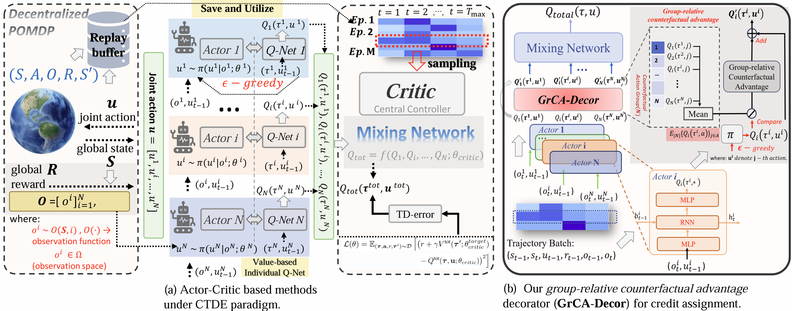
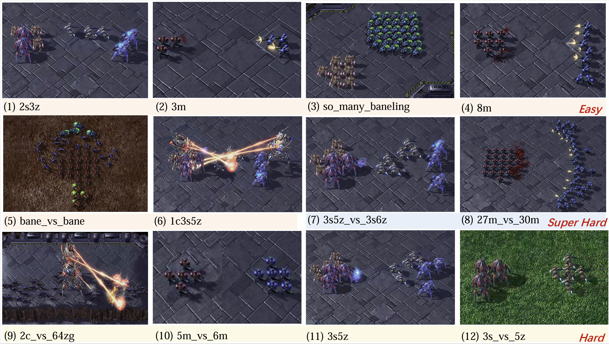
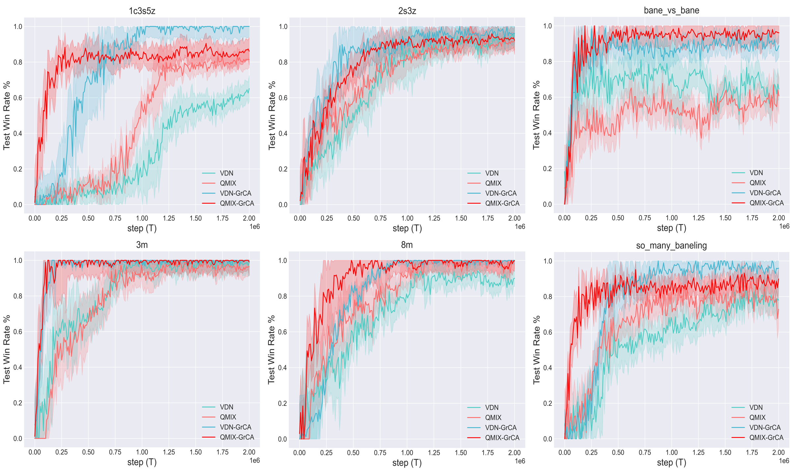
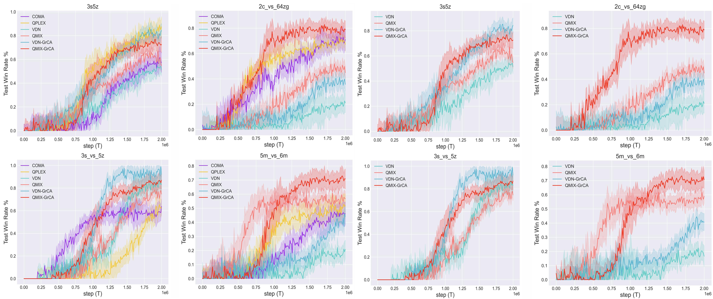

# GrCA-Decor (StarCraft II)
<!-- The anonymous code implementation (with automated function integration tools) of paper: "GrCA-Decor: Group-Relative Counterfactual Advantage Decorator for 
Robust Credit Assignment in Multi-Agent Reinforcement Learning" submitted to ICASSP 2026. -->

[](https://opensource.org/licenses/MIT)
[](https://www.python.org/downloads/)
[](https://pytorch.org/)

Official implementation of Anonymous authors' under-review MARL paper:  
**"GrCA-Decor: Group-Relative Counterfactual Advantage Decorator for Robust Credit Assignment in Multi-Agent Reinforcement Learning"**

[[Paper]](https://arxiv.org/abs/) | [[Project Page]](https://github.com/SmileHappyEveryDay/GrCA-Decor) | [[SMAC Benchmark]](https://github.com/oxwhirl/smac)

[//]: # (XXXX.XXXXX)

## 🚀 Project Overview
GrCA-Decor (Group-Relative Counterfactual Advantage Decorator) is a universal modular decorator designed for value-based Centralized Training with Decentralized Execution (CTDE) algorithms in Multi-Agent Reinforcement Learning (MARL). This project implements the GrCA-Decor module, which enhances individual Q-value estimations by incorporating counterfactual advantages, improving credit assignment among agents.

## Methodology
GrCA-Decor integrates with existing CTDE algorithms (e.g., VDN, QMIX) by:
1. **Counterfactual Advantage Estimation**: Computes the difference between an agent's Q-value for its chosen action and the average Q-value of the same action across all agents.
2. **Individual Q-value Integration**: Combines the original Q-value with the counterfactual advantage to produce an enhanced Q-value estimation.
3. **Mixing Network Integration**: The enhanced Q-values are fed into the CTDE's mixing network (critic) to compute the global Q-value.

---

<p align="center">
  
</p>

---

<!-- Key equations:
- **Counterfactual Advantage**: \(GrCA^i(\tau^i, u^i) = Q^i(\tau^i, u^i) - E_{u^i}\{Q^i(\tau^i, u^i)\}\)
- **Enhanced Q-value**: \(Q'^i(\tau^i, u^i) = Q^i(\tau^i, u^i) + \lambda \cdot GrCA^i(\tau^i, u^i)\) -->

## Implementation
The project includes implementations for VDN and QMIX algorithms, with the GrCA-Decor module integrated into their learning processes. Key functions:
- **`counterfactual_advantage`**: Computes the counterfactual advantage for each agent's action.
- **`learn`**: Updates the policy using the enhanced Q-values and computes the TD-error.

### Key Files
- `policy/qmix.py`: Implements QMIX with GrCA-Decor.
- `policy/vdn.py`: Implements VDN with GrCA-Decor.

## Usage
### Prerequisites
- Python 3.6+
- PyTorch 1.12 (default) [> 1.1x]
- Other dependencies listed in `requirements.txt`

### Installation
1. Clone the repository from anonymous *SmileHappyEveryDay* GitHub:
   ```bash
   git clone https://github.com/SmileHappyEveryDay/GrCA-Decor.git
   cd GrCA-Decor
   ```
2. Install dependencies:
   ```bash
   pip install -r requirements.txt
   ```

### Running the Project
To train the model with GrCA-Decor on a specific algorithm (e.g., QMIX, VDN):

<span style="color:red">[For QMIX-GrCA]</span> 
```bash

CUDA_VISIBLE_DEVICES=0 nohup /home/your_username/anaconda3/envs/sc2/bin/python3 -u /home/your_username/GrCA-Decor-icassp/main.py --map=3s_vs_5z --alg=qmix> 3s_vs_5z-CounterFactual-QMIX.log &
```
<span style="color:red">[For Original QMIX]</span> 
```bash
CUDA_VISIBLE_DEVICES=0 nohup /home/your_username/anaconda3/envs/sc2/bin/python3 -u /home/your_username/GrCA-Decor-icassp/main.py --map=3s_vs_5z --alg=qmix> 3s_vs_5z-Ori-QMIX.log &
```

<span style="color:red">[For VDN-GrCA]</span>
```bash
CUDA_VISIBLE_DEVICES=0 nohup /home/your_username/anaconda3/envs/sc2/bin/python3 -u /home/your_username/GrCA-Decor-icassp/main.py --map=3s_vs_5z --alg=vdn> 3s_vs_5z-CounterFactual-QMIX.log &
```

<span style="color:red">[For Original VDN] 
```bash
CUDA_VISIBLE_DEVICES=0 nohup /home/your_username/anaconda3/envs/sc2/bin/python3 -u /home/your_username/GrCA-Decor-icassp/main.py --map=3s_vs_5z --alg=vdn> 3s_vs_5z-Ori-QMIX.log &
```

### 🌎 SMAC Maps
The visualization of our adopted SMAC multi-agent task scenarios.

<p align="center">
  
</p>

### 📌 Performance on easy maps.

<p align="center">
  
</p>

##### Performance w/o other baselines.

[//]: # (the performance comparison w/o other baselines, QPLEX and COMA.)

<p align="center">
  
</p>


### 📌 [Left]: performance on hard maps. [Right]: with w/o other baselines.

<p align="center">
  
</p>

[//]: # (##### for performance w/o other baselines.)

[//]: # ()
[//]: # ([//]: # &#40;the performance comparison w/o other baselines, QPLEX and COMA.&#41;)
[//]: # ()
[//]: # (<p align="center">)

[//]: # (  )

[//]: # (</p>)

Download the migration tool: [Click here](https://example.com/migration_tool) (link to be updated).

This project is forked from [starry-sky6688/MARL-Algorithms](https://github.com/starry-sky6688/MARL-Algorithms), which also included Pytorch implementations of other multi-agent reinforcement learning algorithms, including 
[IQL](https://arxiv.org/abs/1511.08779),
[QMIX](https://arxiv.org/abs/1803.11485), [VDN](https://arxiv.org/abs/1706.05296), 
[COMA](https://arxiv.org/abs/1705.08926), [QTRAN](https://arxiv.org/abs/1905.05408)(both **QTRAN-base** and **QTRAN-alt**),
[MAVEN](https://arxiv.org/abs/1910.07483), [CommNet](https://arxiv.org/abs/1605.07736), 
[DyMA-CL](https://arxiv.org/abs/1909.02790?context=cs.MA), and [G2ANet](https://arxiv.org/abs/1911.10715), 
which are the state-of-the-art MARL algorithms tested on [SMAC](https://github.com/oxwhirl/smac), the decentralised micromanagement scenario of [StarCraft II](https://en.wikipedia.org/wiki/StarCraft_II:_Wings_of_Liberty).

## References
- Original Paper: [GrCA-Decor: Group-Relative Counterfactual Advantage Decorator for Robust Credit Assignment in Multi-Agent Reinforcement Learning](https://arxiv.org/abs/XXXX.XXXXX)
- VDN: [Value-Decomposition Networks For Cooperative Multi-Agent Learning](https://dl.acm.org/doi/10.5555/3237383.3238080)
- QMIX: [QMIX: Monotonic Value Function Factorisation for Deep Multi-Agent Reinforcement Learning](http://jmlr.org/papers/v21/20-081.html)
- COMA: [Counterfactual multi-agent policy gradients](https://dl.acm.org/doi/10.5555/3504035.3504398)
- QPLEX: [QPLEX: Duplex Dueling Multi-Agent Q-Learning](https://openreview.net/forum?id=Rcmk0xxIQV)

📧 **Contact**  
For questions, please contact:

- Anonymous: anonymous@anonymous.anonymous
- Project maintainer: anonymous

📜 **Citation**  
If you use this work in your research, please cite:

```bibtex
@article{anonymous2025counterfactual,
  title={GrCA-Decor: Group-Relative Counterfactual Advantage Decorator for Robust Credit Assignment in Multi-Agent Reinforcement Learning},
  author={anonymous et al.},
  journal={anonymous},
  year={2025}
}
```

Download the LLM-based automatic migration tool: [Click here](https://github.com/SmileHappyEveryDay/GrCA-Decor/migration_tool.rar) (link to be updated).

## License
This project is licensed under the MIT License. See the `LICENSE` file for details.
